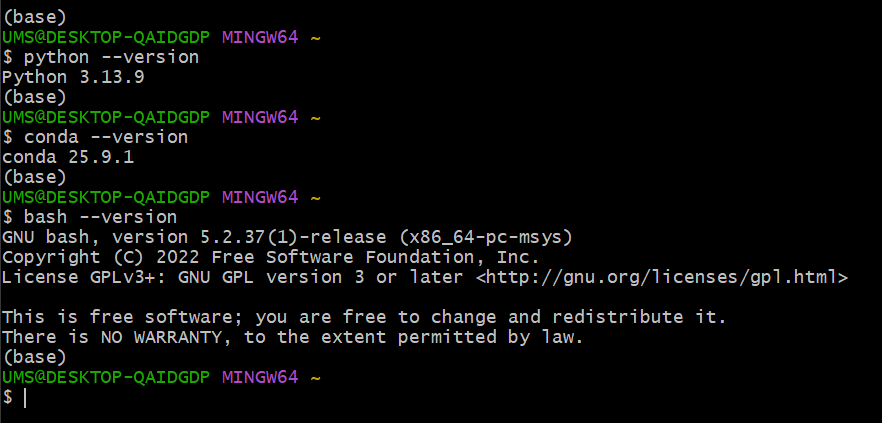
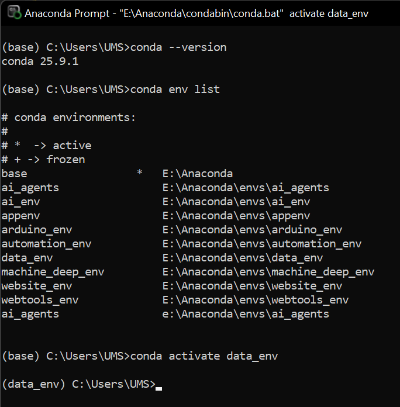
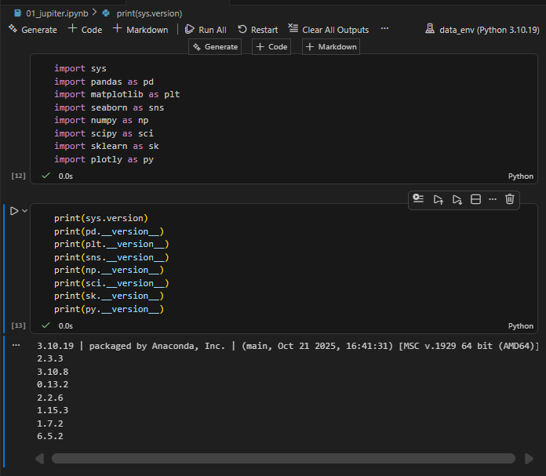
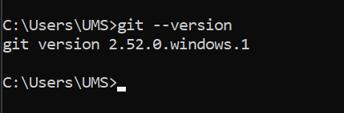
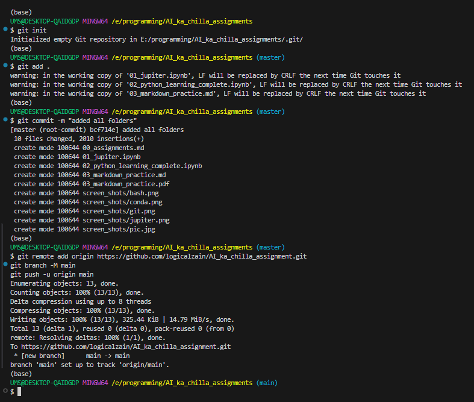
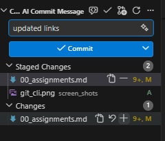
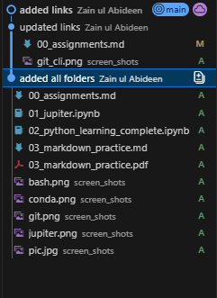
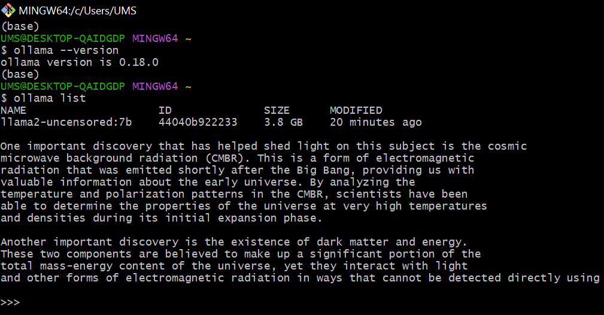

# 1. **Python and Other Software Integration**
## Python & GitBash:

## Anaconda integration:

## Jupyter Notebook & python libraries:

# 2. **Python & Markdown Practice**

[Python](https://github.com/logicalzain/AI_ka_chilla_assignment/blob/main/02_python_learning_complete.ipynb)  
[Markdown](https://github.com/logicalzain/AI_ka_chilla_assignment/blob/main/03_markdown_practice.md)

# 3. **My Portfolio**
[My_Portfolio](https://logicalzain.github.io/portfolio/)

# 4. **Git & Github (CLI, VSCode)**

## Local Repo to Github Repo in CLI:

## Stage, commit, push in VSCode:
    

# 5. **Pandas, Numpy, Seaborn, Matplot & Plotly Practice with Custom Dataset**
[Custom_Dataset](https://github.com/logicalzain/AI_ka_chilla_assignment/blob/main/plot.csv)  
[Data_Visualization](https://github.com/logicalzain/AI_ka_chilla_assignment/blob/main/04_data_analysis_visualization_practice.ipynb)

# 6. **EDA & Pandas-AI with API-keys with Custom Dataset**
[Custom_Dataset](https://github.com/logicalzain/AI_ka_chilla_assignment/blob/main/05_pandas_ai/extended_plot.csv)  
[Pandas_AI](https://github.com/logicalzain/AI_ka_chilla_assignment/blob/main/05_pandas_ai/pandas_ai.ipynb)  
[EDA_Pandas](https://github.com/logicalzain/AI_ka_chilla_assignment/blob/main/05_pandas_ai/pandas_practice.ipynb)
[HTML_EDA](https://github.com/logicalzain/AI_ka_chilla_assignment/blob/main/05_pandas_ai/pandas_profiling_report.html)

# 7. **Project- Currency Rate Comparison (2000-2026)**
[Currency_Rate_Comparison](https://github.com/logicalzain/AI_ka_chilla_assignment/blob/main/06_currency_comparison_project.ipynb)
## data sets:
[Daily_Rate_Comparison](https://github.com/logicalzain/AI_ka_chilla_assignment/blob/main/currency_comparison_data.csv)  
[Yearly_Rate_Comparison](https://github.com/logicalzain/AI_ka_chilla_assignment/blob/main/currency_yearly_summary.csv)

# 8. **Project- Streamlit Applications using AI**
[API_application](https://logicalzain.streamlit.app/)  

# 9. **Ollama Chatbot in PC offline**

# 10. **Machine Learning practice**
[Machine_Learning_Practice](https://github.com/logicalzain/AI_ka_chilla_assignment/tree/main/08_machine_learning_practice).

# 11. **AI Agent Project**
[AI_Agent_Project](https://github.com/logicalzain/AI_ka_chilla_assignment/tree/main/09_ai_agents_custom_project)

# **Final Project Documentation & Presentation**
- [Documentation](https://github.com/logicalzain/AI_ka_chilla_assignment/blob/main/10_final_project/DOCUMENTATION.md)
- [Code](https://github.com/logicalzain/AI_ka_chilla_assignment/tree/main/10_final_project)
